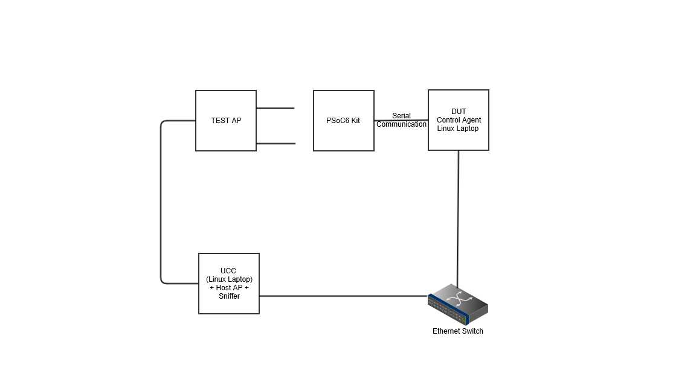

# Wi-Fi Cert Tester tool for AnyCloud SDK

The Wi-Fi Cert Tester tool is used for Wi-Fi certification of 11n-PSK, 11n WPA2 Enterprise, PMF, WPA3, and 11ac. The Wi-Fi Cert Tester tool uses the command console asset to initialize and invoke the wifi-cert middleware init function.

The tool waits for commands from the UCC Test Agent on a serial terminal (UART interface), executes the UCC test commands, and responds to the UCC Test Agent by sending the response in the serial console.

Wi-Fi certification using the tool needs knowledge of the Wi-Fi Alliance test beds and associated software tools and hardware. Instructions in this document conform to the certification requirements of the Wi-Fi Alliance organization.
See https://www.wi-fi.org/download.php?file=/sites/default/files/private/Certification_Overview_v5.2_0.pdf.

## Requirements

- [ModusToolbox™ software](https://www.cypress.com/products/modustoolbox-software-environment) v2.3

- Programming language: C

- Associated parts: All [PSoC&trade; 6 MCU](http://www.cypress.com/PSoC6) parts


## Dependent assets

- [Wi-Fi connection manager](https://github.com/cypresssemiconductorco/wifi-connection-manager)

- [Command console](https://github.com/cypresssemiconductorco/command-console)

- [Wi-Fi Cert library](https://github.com/cypresssemiconductorco/wifi-cert)

- [Enterprise security](https://github.com/cypresssemiconductorco/enterprise-security)


## Supported kits

- [PSoC&trade; 6 Wi-Fi Bluetooth&reg; prototyping kit](https://www.cypress.com/CY8CPROTO-062-4343W) (CY8CPROTO-062-4343W)

- [PSoC&trade; 62S2 Wi-Fi Bluetooth&reg; pioneer kit](https://www.cypress.com/CY8CKIT-062S2-43012)  (CY8CKIT-062S2-43012)


## Test setup

### Hardware setup

This example uses the board's default configuration. See the kit user guide to ensure that the board is configured correctly.

### Wi-Fi Cert Test bed setup

**Figure 1. Simplified Wi-Fi Cert Test bed**



Component | Function
----------|---------
Test AP | Configured per test pre-requisites
DUT Control Agent | A Linux PC connected the PSoC 6 kit (DUT) <br> (see [Supported kits](#supported-kits))
UCC Linux PC | Triggers the test to be run and sends the test commands to the DUT. The Control Agent PC and the DUT Control Agent PC relay the command to the PSoC 6 kit.
PSoC 6 kit | DUT running the Wi-Fi cert tester tool

<br>

### Software setup

This tool requires a serial terminal such as Tera Term, PuTTY, or MiniCom to observe the output. The Wi-Fi Cert Test bed uses Python scripts to take control of the terminal.

### Code checkout and build

Open a serial terminal. On Linux and macOS, you can use any terminal application. On Windows, open the "modus-shell" app from the Start menu.

1. Run the following command:

   ```
   git clone https://github.com/cypresssemiconductorco/mtb-anycloud-wifi-cert-tester

   cd mtb-anycloud-wifi-cert-tester

   make getlibs
   ```

### Build for Hostapd and Radiator supplicants

1. Open the Makefile and comment out the following line:

   ```
   #DEFINES+=MICROSOFT_SUPPLICANT_SERVER
   ```

2. Run the following command:

   ```
   make program TARGET=CY8CKIT-062S2-43012 TOOLCHAIN=GCC_ARM
   ```

### Build for Microsoft supplicant

1. Open the Makefile and uncomment the following line:

   ```
   DEFINES+=MICROSOFT_SUPPLICANT_SERVER
   ```

2. Run the following command:

   ```
   make program TARGET=CY8CKIT-062S2-43012 TOOLCHAIN=GCC_ARM
   ```

## Operation

1. Copy the *../mtb_shared/wifi-cert/latest-v3.X/scripts*  folder into the DUT Control Agent PC.

2. Open the *init_dut_ca.sh* file and locate the following line:

   ```
   sudo modprobe ftdi_sio vendor=0xa5c product=0x43fa
   ```
3. Update the line with correct vendor and product ID for the PSoC&trade; 6 MCU kit. You can get this information using the `dmesg` command after connecting the kit to the PC via the USB cable.

4. Save and close the file.

5. Run the shell script and make sure that the FTDI driver is displayed with *tty/ACM*:

   ```
   ./scripts/init_dut_ca.sh
   ```

6. Set the following on the terminal application:

   - Set the serial port to `/dev/ttyACM0`.

   - Set the baud rate as 115200 and turn off hardware flow control.

7. Run the following script:

   ```
   ./dut_ca.py -t /dev/ttyACM$x
   ```

	'x' can be 0 to ..n.

	Now the Kit is ready for commands from the UCC Test Agent. The UCC PC runs the test as a batch command (i.e., series of tests) or individual tests. The test script configures the Test AP per the pre-requisites, and then runs the actual tests. Test results are collected in the UCC PC under the */logs* folder for the particular test.

8. Type `list` on the console to get the list of Wi-Fi Cert test tool commands:

   ```
   0. sta_get_ip_config

   1. sta_set_ip_config

   2. sta_get_info

   3. sta_get_mac_address

   4. sta_is_connected

   5. sta_verify_ip_connection

   6. sta_get_bssid

   7. ca_get_version

   8. device_get_info

   9. device_list_interfaces

   10. sta_set_encryption

   11. sta_set_psk

   12. sta_set_security

   13. sta_associate

   14. sta_preset_testparameters

   15. traffic_send_ping

   16. traffic_stop_ping

   17. traffic_agent_config

   18. traffic_agent_reset

   19. traffic_agent_send

   20. traffic_agent_receive_start

   21. traffic_agent_receive_stop

   22. sta_set_11n

   23. sta_disconnect

   24. sta_scan

   25. sta_reassoc

   26. sta_reset_default

   27. sta_set_wireless

   28. whdlog

   29. wicedlog

   30. reboot
   ```

All other trademarks or registered trademarks referenced herein are the property of their respective owners.


-------------------------------------------------------------------------------

© Cypress Semiconductor Corporation, 2021. This document is the property of Cypress Semiconductor Corporation, an Infineon Technologies company, and its affiliates ("Cypress").  This document, including any software or firmware included or referenced in this document ("Software"), is owned by Cypress under the intellectual property laws and treaties of the United States and other countries worldwide.  Cypress reserves all rights under such laws and treaties and does not, except as specifically stated in this paragraph, grant any license under its patents, copyrights, trademarks, or other intellectual property rights.  If the Software is not accompanied by a license agreement and you do not otherwise have a written agreement with Cypress governing the use of the Software, then Cypress hereby grants you a personal, non-exclusive, nontransferable license (without the right to sublicense) (1) under its copyright rights in the Software (a) for Software provided in source code form, to modify and reproduce the Software solely for use with Cypress hardware products, only internally within your organization, and (b) to distribute the Software in binary code form externally to end users (either directly or indirectly through resellers and distributors), solely for use on Cypress hardware product units, and (2) under those claims of Cypress’s patents that are infringed by the Software (as provided by Cypress, unmodified) to make, use, distribute, and import the Software solely for use with Cypress hardware products.  Any other use, reproduction, modification, translation, or compilation of the Software is prohibited.
<br>
TO THE EXTENT PERMITTED BY APPLICABLE LAW, CYPRESS MAKES NO WARRANTY OF ANY KIND, EXPRESS OR IMPLIED, WITH REGARD TO THIS DOCUMENT OR ANY SOFTWARE OR ACCOMPANYING HARDWARE, INCLUDING, BUT NOT LIMITED TO, THE IMPLIED WARRANTIES OF MERCHANTABILITY AND FITNESS FOR A PARTICULAR PURPOSE.  No computing device can be absolutely secure.  Therefore, despite security measures implemented in Cypress hardware or software products, Cypress shall have no liability arising out of any security breach, such as unauthorized access to or use of a Cypress product.  CYPRESS DOES NOT REPRESENT, WARRANT, OR GUARANTEE THAT CYPRESS PRODUCTS, OR SYSTEMS CREATED USING CYPRESS PRODUCTS, WILL BE FREE FROM CORRUPTION, ATTACK, VIRUSES, INTERFERENCE, HACKING, DATA LOSS OR THEFT, OR OTHER SECURITY INTRUSION (collectively, "Security Breach").  Cypress disclaims any liability relating to any Security Breach, and you shall and hereby do release Cypress from any claim, damage, or other liability arising from any Security Breach.  In addition, the products described in these materials may contain design defects or errors known as errata which may cause the product to deviate from published specifications.  To the extent permitted by applicable law, Cypress reserves the right to make changes to this document without further notice. Cypress does not assume any liability arising out of the application or use of any product or circuit described in this document.  Any information provided in this document, including any sample design information or programming code, is provided only for reference purposes.  It is the responsibility of the user of this document to properly design, program, and test the functionality and safety of any application made of this information and any resulting product.  "High-Risk Device" means any device or system whose failure could cause personal injury, death, or property damage.  Examples of High-Risk Devices are weapons, nuclear installations, surgical implants, and other medical devices.  "Critical Component" means any component of a High-Risk Device whose failure to perform can be reasonably expected to cause, directly or indirectly, the failure of the High-Risk Device, or to affect its safety or effectiveness.  Cypress is not liable, in whole or in part, and you shall and hereby do release Cypress from any claim, damage, or other liability arising from any use of a Cypress product as a Critical Component in a High-Risk Device.  You shall indemnify and hold Cypress, including its affiliates, and its directors, officers, employees, agents, distributors, and assigns harmless from and against all claims, costs, damages, and expenses, arising out of any claim, including claims for product liability, personal injury or death, or property damage arising from any use of a Cypress product as a Critical Component in a High-Risk Device.  Cypress products are not intended or authorized for use as a Critical Component in any High-Risk Device except to the limited extent that (i) Cypress’s published data sheet for the product explicitly states Cypress has qualified the product for use in a specific High-Risk Device, or (ii) Cypress has given you advance written authorization to use the product as a Critical Component in the specific High-Risk Device and you have signed a separate indemnification agreement.
<br>
Cypress, the Cypress logo, and combinations thereof, WICED, ModusToolBox, PSoC, CapSense, EZ-USB, F-RAM, and Traveo are trademarks or registered trademarks of Cypress or a subsidiary of Cypress in the United States or in other countries.  For a more complete list of Cypress trademarks, visit cypress.com.  Other names and brands may be claimed as property of their respective owners.
